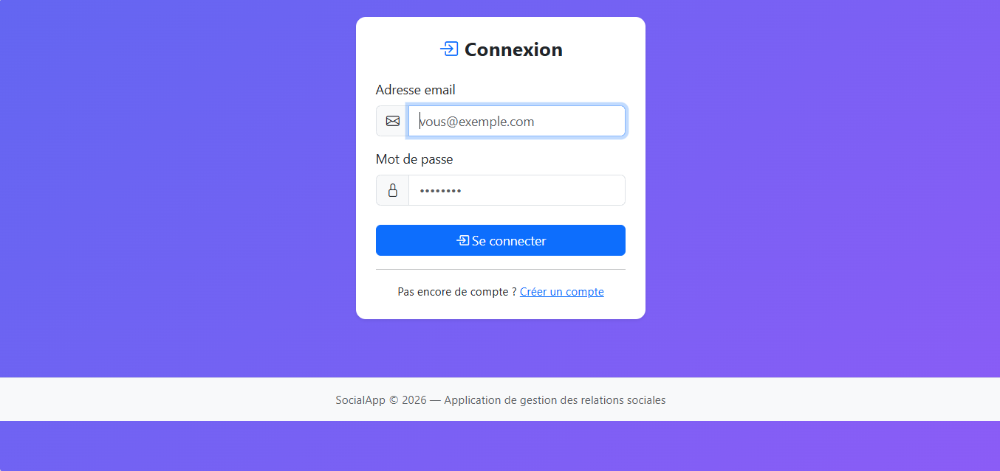
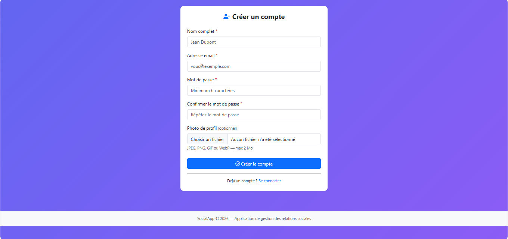
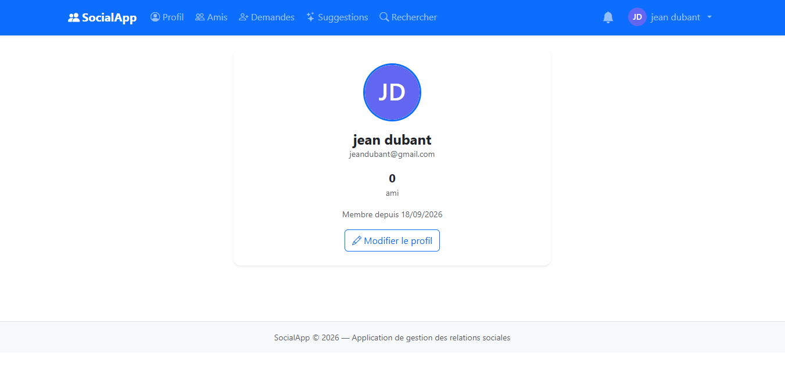
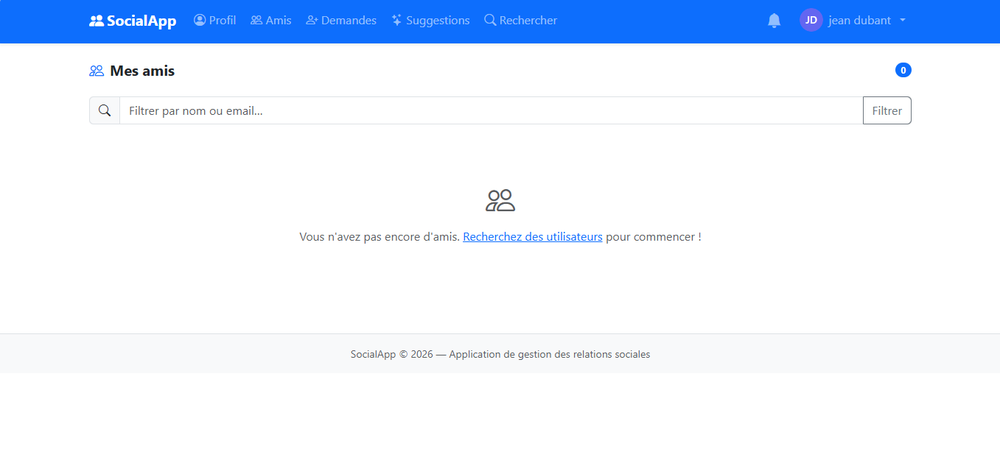

# SocialApp — Application de gestion des relations sociales

Application web PHP/MySQL (Mini Projet 2025-2026).

## Stack technique

| Couche       | Technologie                  |
|-------------|------------------------------|
| Back-end     | PHP 8.0+ (OOP, PDO)          |
| Base de données | MySQL 5.7+ / MariaDB      |
| Front-end    | Bootstrap 5.3 + Bootstrap Icons |
| Architecture | MVC (front controller)       |

---

## Installation

### 1. Créer la base de données

```bash
mysql -u root -p < sql/schema.sql
```

### 2. Configurer la connexion

Éditez `config/config.php` et renseignez vos identifiants MySQL :

```php
define('DB_HOST', 'localhost');
define('DB_NAME', 'social_app');
define('DB_USER', 'root');
define('DB_PASS', 'votre_mot_de_passe');
```

### 3. Déployer avec Apache / XAMPP / Laragon

Placez le dossier `social-app/` dans votre répertoire web (`htdocs/`, `www/`, etc.)
puis accédez à :

```
http://localhost/social-app/
```

### 4. Permissions du dossier uploads

```bash
chmod 755 public/uploads/
```

---

## Structure du projet

```
social-app/
├── index.php                  # Front controller (routeur)
├── config/
│   └── config.php             # Paramètres DB et upload
├── core/
│   ├── Database.php           # Singleton PDO
│   └── helpers.php            # CSRF, flash, avatar, upload…
├── models/
│   ├── User.php
│   ├── FriendRequest.php
│   ├── Friend.php
│   └── Notification.php
├── controllers/
│   ├── AuthController.php
│   ├── UserController.php
│   ├── FriendRequestController.php
│   ├── FriendController.php
│   └── NotificationController.php
├── views/
│   ├── partials/
│   │   ├── header.php         # Navbar + flash
│   │   └── footer.php
│   ├── auth/
│   │   ├── login.php
│   │   └── register.php
│   ├── profile/
│   │   ├── view.php
│   │   └── edit.php
│   ├── search/
│   │   └── index.php
│   ├── friends/
│   │   ├── list.php
│   │   ├── requests.php
│   │   └── suggestions.php
│   └── notifications/
│       └── index.php
├── public/
│   ├── css/style.css
│   └── uploads/               # Photos de profil (écriture requise)
└── sql/
    └── schema.sql             # Schéma complet
```

---

## Fonctionnalités implémentées

### Gestion des utilisateurs
- ✅ Inscription avec photo de profil (optionnelle)
- ✅ Connexion / Déconnexion
- ✅ Accès protégé — redirection vers `/login` si non authentifié
- ✅ Modification du profil (nom, email, mot de passe, photo)
- ✅ Suppression du compte (confirmation par mot de passe)
- ✅ Sécurisation des mots de passe via `password_hash(PASSWORD_DEFAULT)`

### Gestion des demandes d'amis
- ✅ Recherche d'utilisateurs et envoi de demande
- ✅ Annulation d'une demande envoyée
- ✅ Acceptation / Refus d'une demande reçue
- ✅ Liste des demandes envoyées avec statut (EN_ATTENTE / ACCEPTEE / REJETEE)
- ✅ Liste des demandes reçues en attente
- ✅ Contraintes : impossibilité d'envoyer à soi-même, doublon ou si déjà ami

### Gestion des amitiés
- ✅ Amitié symétrique créée à l'acceptation (une seule ligne par paire)
- ✅ Comptage dynamique du nombre d'amis
- ✅ Liste des amis avec recherche intégrée
- ✅ Suppression d'un ami
- ✅ Affichage des amis en commun sur la page profil (BONUS)

### Système de notifications
- ✅ Génération automatique pour : réception, acceptation, refus
- ✅ Badge de notifications non lues dans la navbar
- ✅ Marquer une notification comme lue
- ✅ Marquer toutes les notifications comme lues
- ✅ Indicateur visuel (badge rouge) sur la cloche

### BONUS
- ✅ Suggestions d'amis basées sur les amis en commun
- ✅ Affichage du nombre d'amis en commun sur profil et suggestions
- ✅ Protection CSRF sur tous les formulaires
- ✅ Validation MIME réelle des fichiers uploadés (finfo)

---

## Sécurité

| Mesure | Détail |
|--------|--------|
| Mots de passe | `password_hash / password_verify` (bcrypt) |
| Requêtes SQL | PDO avec requêtes préparées uniquement |
| Sorties HTML | `htmlspecialchars()` sur toutes les valeurs affichées |
| CSRF | Token aléatoire (32 octets) vérifié sur chaque POST |
| Upload | Vérification du vrai type MIME via `finfo`, extension normalisée |
| Session | `session_regenerate_id(true)` à la connexion |
=======
# 🌐 Social App

A full-stack social networking web application developed with **PHP** and **MySQL**, following an **MVC-inspired architecture**.

The application provides core social-networking features such as user authentication, profiles, friendships, friend requests, suggestions, notifications, and media uploads.

---

## 📸 Screenshots

Screenshots of the application will be added here.

### Login



### Register



### Profile



### Friends




---

## 🚀 About the Project

**Social App** is a social networking web application developed as a full-stack web project.

The main goal of this project was to practice and demonstrate web development skills, including:

- Backend development with PHP
- Relational database management with MySQL
- User authentication and session management
- MVC-inspired application organization
- CRUD operations
- Relationships between users
- Friend request management
- Notification handling
- File and image uploads
- Frontend development with HTML, CSS and JavaScript

The application is organized into separate components to make the code easier to understand, maintain, and extend.

---

## ✨ Features

### 🔐 Authentication

- User registration
- User login
- User logout
- Session-based authentication
- Access control for authenticated users

### 👤 User Management

- User profiles
- Profile information
- Profile editing
- Profile picture upload

### 🤝 Friend Management

- Send friend requests
- Accept friend requests
- Decline friend requests
- View friends
- Manage existing friendships

### 💡 Friend Suggestions

- Discover potential connections
- Display suggested users

### 🔔 Notifications

- Notifications for user activity
- Notifications related to friend requests
- Notification management

### 🖼️ Media Uploads

- Profile picture uploads
- Media file handling
- Server-side upload management

### 📱 Responsive Interface

- Desktop-friendly interface
- Mobile-friendly layout
- Responsive HTML/CSS components

### 🗄️ Database Integration

- MySQL relational database
- Structured database schema
- PHP/MySQL application communication

---

## 🛠️ Technologies Used

| Category | Technology |
|----------|------------|
| Backend | PHP |
| Database | MySQL |
| Frontend | HTML5, CSS3, JavaScript |
| Local Server | XAMPP |
| Architecture | MVC-inspired |
| Version Control | Git & GitHub |

---

## 🏗️ Architecture

The application follows an **MVC-inspired architecture** to separate the main responsibilities of the application.

### Model

The models are responsible for:

- Database interactions
- Data retrieval
- Data creation and modification
- User-related operations
- Friendship-related operations
- Notification-related operations

### Controller

The controllers are responsible for:

- Processing requests
- Application logic
- Authentication
- Friend requests
- Notifications
- User management
- Friend management

### View

The views are responsible for:

- HTML pages
- User interface
- Forms
- Displaying application data

This organization helps keep the codebase structured and easier to maintain.

---

## 📂 Project Structure

```text
social-app/
│
├── config/
│   └── config.php
│
├── controllers/
│   ├── AuthController.php
│   ├── FriendController.php
│   ├── FriendRequestController.php
│   ├── NotificationController.php
│   └── UserController.php
│
├── core/
│   ├── Database.php
│   └── helpers.php
│
├── models/
│   ├── User.php
│   ├── Friend.php
│   ├── FriendRequest.php
│   └── Notification.php
│
├── public/
│   ├── css/
│   └── uploads/
│
├── views/
│   ├── auth/
│   └── ...
│
├── index.php
│
├── social_app.sql
│
└── README.md

